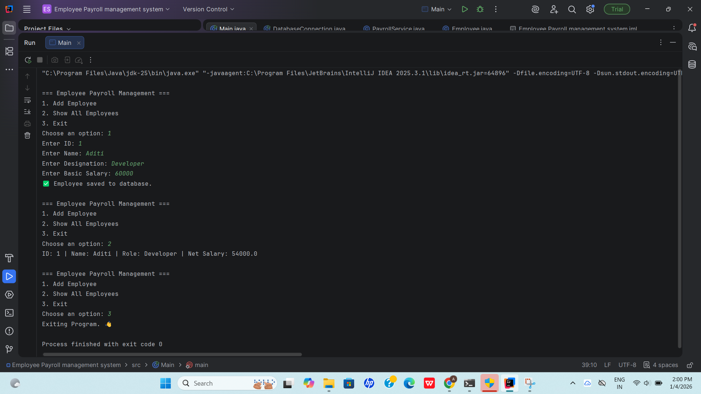
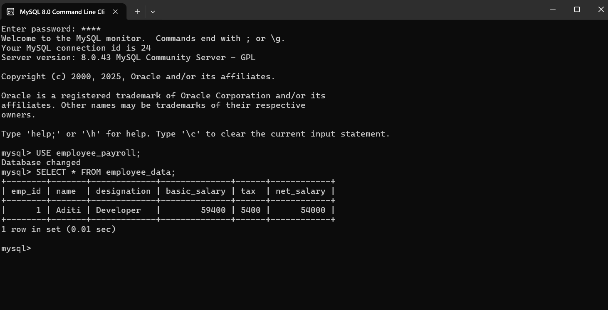

# Employee-Payroll-Management-System-Java-SQL
A console-based Java project for managing employee payrolls using MySQL and JDBC.
A **Java + MySQL-based console application** that allows users to manage employee payrolls efficiently.  
Built using **Object-Oriented Programming** principles and **JDBC** for real-world database connectivity.

## 🚀 Features

✅ Add new employee details  
✅ Store employee data securely in MySQL  
✅ Display all employees in a formatted list  
✅ Modular Java structure (`model`, `service`, `main`)  
✅ MySQL database integration with JDBC  

## 🧠 Technologies Used
- Java (OOP, Collections)
- MySQL (Database)
- JDBC (Database Connectivity)
- IntelliJ IDEA (IDE)

## Project Structure
Employee-Payroll-Management-System/
├── src/
│ ├── model/
│ │ └── Employee.java
│ ├── service/
│ │ ├── PayrollService.java
│ │ └── DatabaseConnection.java
│ └── Main.java
├── README.md
├── output.png 
├── input.png 

## Project Description
The Employee Payroll Management System is a console-based Java application designed for beginner software engineers.
 
 # It demonstrates:
Object-Oriented Programming (OOP) structure
Database connectivity with JDBC
Data persistence using MySQL
Real-world payroll operations simulation
This project is an ideal portfolio piece for entry-level software developer positions.

## 🖼️ Screenshots

### 📥 Input Screenshot

### 📤 Output Screenshot

